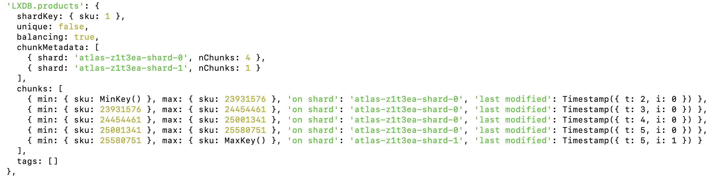
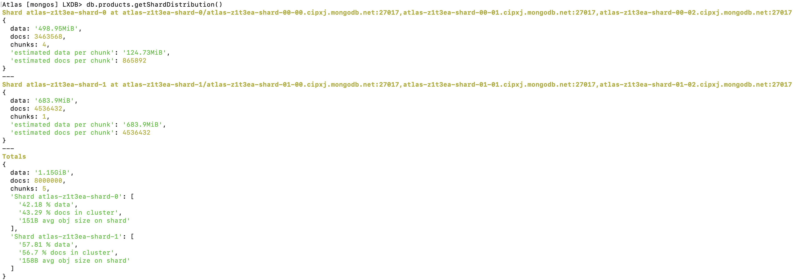
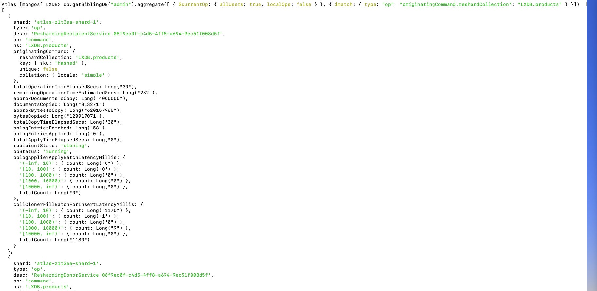
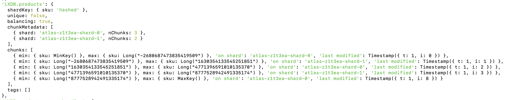
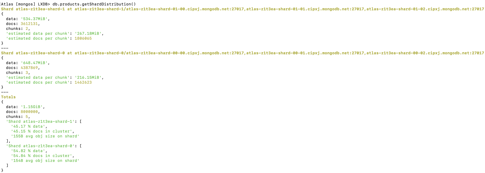
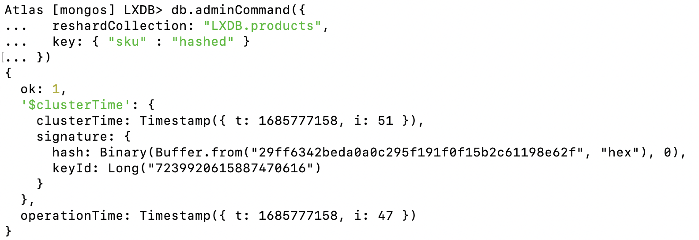

# MongoDB Atlas Sharding Workshop

## Introduction
This objective of this workshop is to demostrate the following:
1.  Create a MongoDB sharded cluster in MongoDB Atlas (from a M10 replica set to a 2-shard M30 sharded cluster)
2.  Create a database and collection via MongoDB Compass or Atlas UI
3.  Import documents into the collection via MongoDB Compass
4.  Enable sharding for the databases that we want to shard
5.  Create an index on the shard key via MongoDB Compass, Atlas UI or mongosh (if the sharded collection has data or is not empty)
6.  Shard the collection that we want to shard
7.  Show sharding status via `sh.status()`
8.  Show shard distribution via `db.collection.getShardDistribution()`
9.  **(OPTIONAL)** Live re-sharding to a new shard key (in this case the hashed index of the same field as the new shard key)
10.  **(OPTIONAL)** Monitoring the re-sharding operation using the `$currentOp` pipeline stage
11.  **(OPTIONAL)** Show sharding status via `sh.status()` and compare the difference to the one before
12.  **(OPTIONAL)** Show shard distribution via `db.collection.getShardDistribution()` and compare the difference to the one before
13.  **(OPTIONAL)** Finishing the re-sharding operation

## Pre-requisites and Notes
1.  Install mongosh and MongoDB Compass.  Minimally install mongosh.
    - [Download and install mongosh](https://www.mongodb.com/try/download/shell)
    - [Download and install MongoDB Compass](https://www.mongodb.com/try/download/compass)
2.  Download this [zip file](https://drive.google.com/file/d/1k63K3BOCm5zunyeyq-oADJdzbDHtCQze/view?usp=sharing) that contains the json documents required in this lab.
3.  At the time of compiling this lab, MongoDB Atlas version 6.0.6 is used.

## Steps

### 1 - Create a MongoDB sharded cluster in MongoDB Atlas (from a M10 replica set to a 2-shard M30 sharded cluster)
1.  Look and follow my steps on the screen so that you could create your own Atlas sharded cluster in the Atlas environment that I have provided you.

### 2 - Create a database and collection via MongoDB Compass or Atlas UI
1.  database name = LXDB
2.  collection name = products

### 3 - Import documents into the collection via MongoDB Compass
1.  Please use the json file that I have prepared for you and import the file into the collection.

### 4 - Enable sharding for the databases that we want to shard
1.  Use the following commands:
```
sh.enableSharding("LXDB")
```

### 5 - Create an index on the shard key via MongoDB Compass, Atlas UI or mongosh (if the sharded collection has data or is not empty)
1.  This is trying to simulate range sharding.  Based on the collection, you might get an unbalanced shard distribution.
2.  Use the following commands:
```
use LXDB
db.products.createIndex( { "sku": 1 } )
```

### 6 - Shard the collection that we want to shard
1.  Use the following commands:
```
sh.shardCollection( "LXDB.products", { "sku":1 })
```

### 7 -  Show sharding status via sh.status()
1.  Use the following commands:
```
sh.status()
```
2.  Under `collections` section, you could see the shard key used, the number of chunks in each shard, the range of the min and max of each chunk for the sharded collection.  Please see the following screenshot as an example:



### 8 - Show shard distribution via db.collection.getShardDistribution()
1.  Use the following commands:
```
db.products.getShardDistribution()
```
2.  Using this command, you could see further into the shards on top of what `sh.status()` could provide.  You could see the estimated data per chunk, the estimated docs per chunk under each shard.  You could also see the percentage(%) of data and docs, and average object size on the shards.  Please see the following screenshot as an example:



### 9 - **(OPTIONAL)** Live re-sharding to a new shard key (in this case the hashed index of the same field as the new shard key)
1.  Use the following commands:
```
db.adminCommand({
  reshardCollection: "LXDB.products",
  key: { "sku" : "hashed" }
})
```

### 10 - **(OPTIONAL)** Monitoring the re-sharding operation using the $currentOp pipeline stage
1.  Launch another command shell, login to Atlas sharded cluster via mongosh and then use the following commands:
```
db.getSiblingDB("admin").aggregate([
  { $currentOp: { allUsers: true, localOps: false } },
  {
    $match: {
      type: "op",
      "originatingCommand.reshardCollection": "LXDB.products"
    }
  }
])
```
2.  This will take some time but all cloning and re-balancing of data between the shards under the new shard key is fully automated and app connectivity continues non-disruptively.  Using this command, you would be able to see the details of the re-sharding process of the sharded collection, more importantly, the `totalOperationTimeElapsedSecs` and `remainingOperationTimeEstimatedSecs`.  Please see the following screenshot as an example:



### 11 - **(OPTIONAL)** Show sharding status via sh.status() and compare the difference to the one before
1.  Use the following commands:
```
sh.status()
```
2.  You should see the difference in the number of chunks in each shard, the min and max of each chunk etc.  Please see the following screenshot as an example:



### 12 - **(OPTIONAL)** Show shard distribution via db.collection.getShardDistribution() and compare the difference to the one before
1.  Use the following commands:
```
db.products.getShardDistribution()
```
2.  Using this command, beside the same amount of details that you could get, you could also see that the percentage(%) of data and docs in the shards are more evenly distributed now that we are using hashed index/sharding.  Please see the following screenshot as an example:



### 13 - **(OPTIONAL)** Finishing the re-sharding operation
1.  Once the re-sharding is successfully completed, you could see the following screenshot.  Even for a collection with 8 million (small) documents, the time taken to complete re-sharding due to the change of shard key it takes is pretty impressive ;). 




